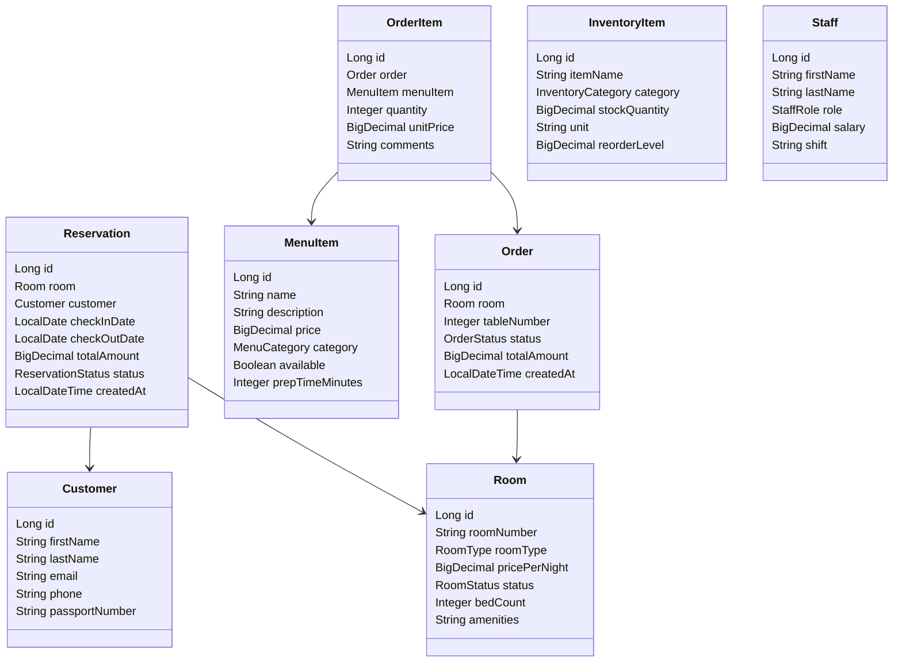

# Hotel & Restaurant Management Service (GraalVM Native + Java 25)

A premium, production-grade Spring Boot 4.1.0 backend service designed to manage hotel and restaurant operations, optimized for GraalVM Native Image compilation and targeting **Java 25**. 

This service demonstrates high-performance patterns designed to sustain **100+ Transactions Per Second (TPS)** with an optimized PostgreSQL persistence layer, customized multi-tier Redis caching, dynamic Testcontainers integration, and a high-performance batch data injector capable of seeding millions of records.

---

## 🚀 Key Features & Constraints Met

1. **Java 25 & Spring Boot 4.1.0:** Built using the latest Java 25 language features (Records for DTOs, Pattern Matching) and Spring Boot 4.x for native JDK 25 bytecode compatibility.
2. **Pure Java (Lombok-Free):** Avoids annotation processors like Lombok to prevent compiler conflicts on modern JDK runtimes, ensuring clean and fast compilation.
3. **Optimized Persistence & Caching:** Powered by PostgreSQL and Redis. Custom Redis TTL policies are configured to match domain volatility:
   - `menuItems` (static catalog) ➔ **1 Hour** TTL
   - `rooms` (semi-static catalog) ➔ **30 Minutes** TTL
   - `roomAvailability` (highly volatile) ➔ **5 Minutes** TTL
4. **Elaborate Domain Services:**
   - **Order Stock Deductions:** Placing kitchen or restaurant orders automatically verifies and deducts raw stock from the inventory using atomic JPA updates.
   - **Unified Checkout Invoice:** Computes final customer invoices, combining room stay charges (based on checked-in/checked-out dates) with all restaurant order charges billed to the room.
5. **100+ TPS Test Data Generator:** Generates millions of records across 8 tables using a highly optimized `JdbcTemplate` batch updater with Postgres-specific `reWriteBatchedInserts=true` query rewrites.
6. **BDD Test Suite (Testcontainers):** Includes unit tests and full-fledged integration/BDD tests backed by ephemeral PostgreSQL and Redis test containers managed via Testcontainers.

---

## 🏛️ Domain Architecture

The service models **8 core entities** to support elaborate hotel and restaurant operations:



---

## 🛠️ Prerequisites

To run this application, ensure you have the following installed:
*   **Java JDK 26** (or **JDK 25** minimum)
*   **Docker Desktop** (version 29.5+ or equivalent)
*   **Maven 3.9+** (or use the packaged `./mvnw` wrapper)

---

## ⚙️ How to Run & Verify

### 1. Compile and Package
Compile the application with the host JDK:
```bash
JAVA_HOME=/opt/homebrew/Cellar/openjdk/26.0.1/libexec/openjdk.jdk/Contents/Home ./mvnw clean compile
```

### 2. Run the Test Suite (with Testcontainers)
The integration test suite will dynamically pull and spin up PostgreSQL and Redis testcontainers. To run the suite under macOS (specifying user context socket for Docker Desktop):
```bash
DOCKER_HOST=unix://$HOME/.docker/run/docker.sock DOCKER_API_VERSION=1.45 JAVA_HOME=/opt/homebrew/Cellar/openjdk/26.0.1/libexec/openjdk.jdk/Contents/Home ./mvnw clean test -Dapi.version=1.45
```

### 3. Run Locally (Docker Compose)
To compile the multi-stage GraalVM native binary and start the complete environment (App, Postgres, Redis):
```bash
docker compose up --build
```
*Note: The builder uses `ghcr.io/graalvm/native-image-community:25` to compile the app to a lightweight, zero-JVM native executable running on a `debian:bookworm-slim` runtime container.*

---

## 🔌 REST API Reference

The server binds to port `8080` by default.

### 1. Data Injection & Seeding
*   **Load Static Catalog (Base Setup):**
    ```http
    POST /api/generator/setup
    ```
    Resets tables and loads 120 rooms, 150 menu items, 100 inventory ingredients, and 50 staff records.
*   **Generate Millions of Records (Batch Loader):**
    ```http
    POST /api/generator/millions?customersCount=50000&reservationsCount=100000&ordersCount=200000&orderItemsCount=800000
    ```
    Loads the database with high-performance JDBC batch inserts.

### 2. Room Service
*   **Get Room by ID:** `GET /api/rooms/{id}`
*   **Check Availability for Dates:**
    ```http
    GET /api/rooms/{id}/availability?checkIn=2026-07-15&checkOut=2026-07-18
    ```
    Queries room schedule occupancy, backed by a 5-minute Redis availability cache.

### 3. Booking & Reservation
*   **Create Reservation:**
    ```http
    POST /api/reservations
    Content-Type: application/json

    {
        "roomId": 1,
        "customerEmail": "guest.smith@example.com",
        "customerFirstName": "John",
        "customerLastName": "Smith",
        "customerPhone": "+15550192",
        "customerPassportNumber": "US123456",
        "checkInDate": "2026-07-16",
        "checkOutDate": "2026-07-18"
    }
    ```

### 4. Restaurant Ordering & Stock Deductions
*   **Submit Food/Beverage Order:**
    ```http
    POST /api/orders
    Content-Type: application/json

    {
        "roomId": 1,
        "tableNumber": null,
        "items": [
            {
                "menuItemId": 12,
                "quantity": 2,
                "comments": "No onions"
            }
        ]
    }
    ```
    *Deducts the item's recipe ingredients from the inventory table atomically. Warnings are logged if matching ingredients do not exist, allowing operations to proceed.*

### 5. Unified Billing & Check-Out
*   **Generate Unified Checkout Invoice:**
    ```http
    GET /api/billing/reservation/{reservationId}
    ```
    Returns a breakdown of room charges, restaurant/room service orders, calculated taxes (10%), and the grand total.
