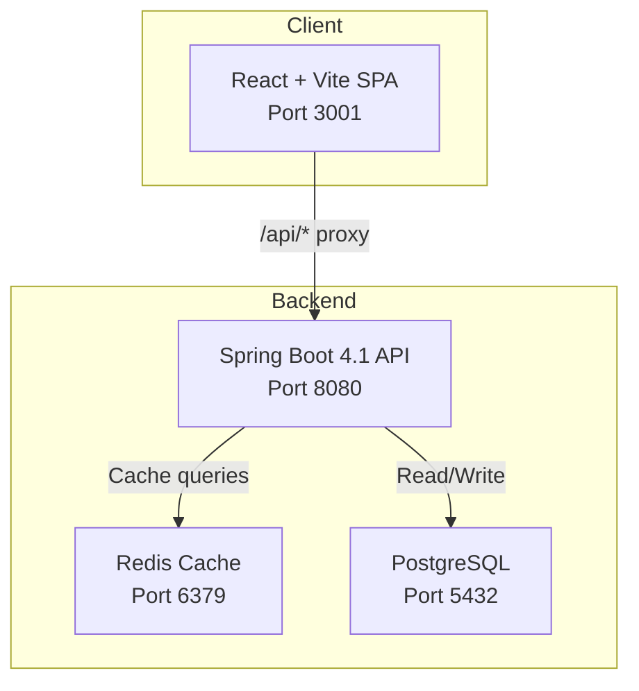
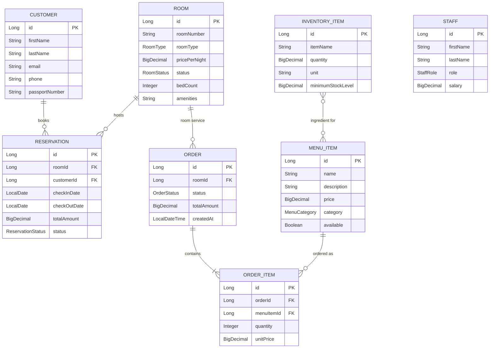

# Architecture

Aetheria Resort is designed as a monorepo containing three independent tiers: a **Spring Boot API backend**, a **React SPA frontend**, and this **Docusaurus documentation site**.

---

## Technology Stack

| Layer | Technology | Version |
|-------|-----------|---------|
| **Language** | Java | 25 |
| **Backend Framework** | Spring Boot | 4.1.0 |
| **Frontend Framework** | React + Vite | 19 / 8 |
| **Database** | PostgreSQL | 16 |
| **Cache** | Redis | 7 |
| **Serialization** | Jackson | 3 (`tools.jackson`) |
| **Migrations** | Flyway | Latest |
| **Testing** | JUnit 5, Testcontainers | Latest |
| **Native Compilation** | GraalVM | 25 |
| **Documentation** | Docusaurus | 3.x |

---

## High-Level Architecture

---

## Domain Model

The system models **8 core entities** across hotel and restaurant operations:

---

## Caching Strategy

Redis caching is implemented with **domain-specific TTL policies** to balance freshness against load:

| Cache Region | TTL | Rationale |
|-------------|-----|-----------|
| `menuItems` | **1 Hour** | Static catalog data, rarely changes |
| `rooms` | **30 Minutes** | Semi-static; room attributes change infrequently |
| `roomAvailability` | **5 Minutes** | Highly volatile; check-ins/check-outs happen frequently |

The serializer uses Jackson 3's `GenericJacksonJsonRedisSerializer` with `BasicPolymorphicTypeValidator` for secure polymorphic deserialization — a requirement after the deprecation of `GenericJackson2JsonRedisSerializer` in Spring Data Redis 4.0.

---

## Design Principles

- **Pure Java (Lombok-Free):** Avoids annotation processors like Lombok to prevent compiler conflicts on modern JDK runtimes.
- **Atomic Stock Deductions:** Kitchen orders automatically verify and deduct inventory using JPA `@Modifying` queries.
- **Unified Billing:** Checkout invoices combine room stay charges with all restaurant charges billed to the room.
- **Batch Data Generation:** High-performance `JdbcTemplate` batch inserts with Postgres-specific `reWriteBatchedInserts=true` for seeding millions of test records.
