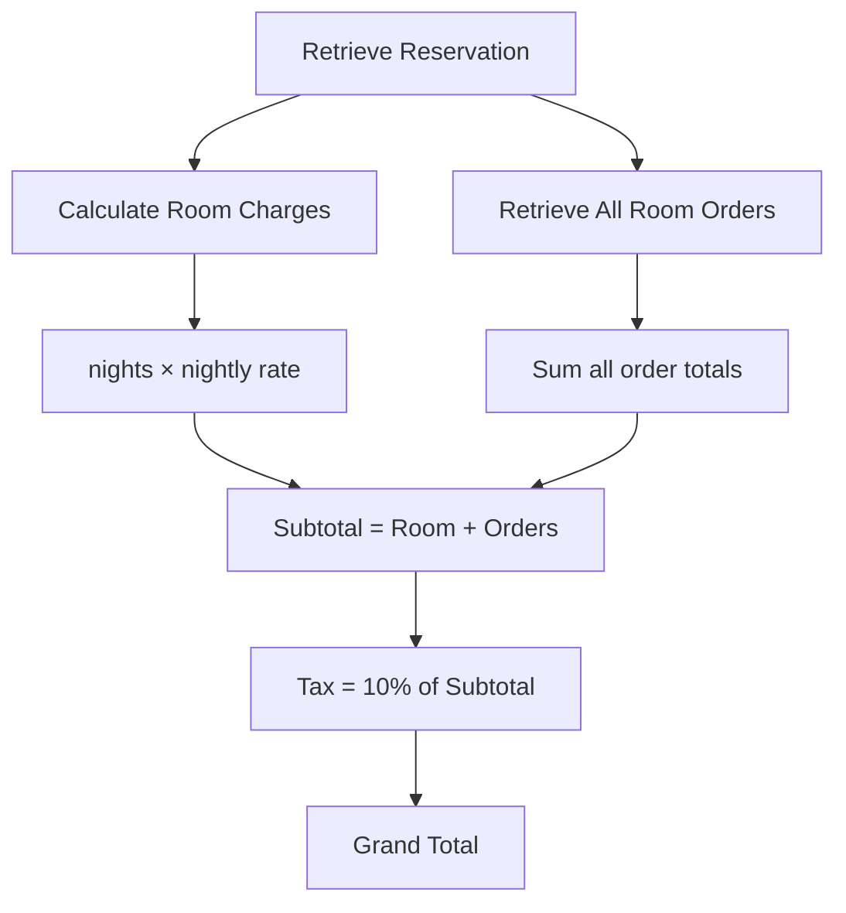

# Billing & Invoices

The Billing module generates **unified checkout invoices** that combine room stay charges with all restaurant/room service orders attributed to the guest's room.

---

## Invoice Calculation

When a checkout invoice is generated for a reservation:

### Breakdown

| Component | Calculation |
|-----------|------------|
| **Room Charges** | Number of nights × room's nightly rate |
| **Restaurant Charges** | Sum of all order totals for the room |
| **Subtotal** | Room + Restaurant charges |
| **Tax** | 10% of subtotal |
| **Grand Total** | Subtotal + Tax |

---

## Invoice Response Fields

The API returns a structured invoice containing:
- Guest name, room number, and stay dates
- Room charge line items
- Individual restaurant order line items with timestamps
- Tax calculation
- Grand total

---

## Frontend UI

The Billing page in the dashboard provides:
- **Reservation selector** to pick active bookings for invoice generation
- **Itemized invoice view** with room charges, individual order breakdowns, tax, and grand total
- **Print-ready** layout for guest receipts

---

## API Endpoints

See [API Reference → Billing](/docs/api-reference#billing) for the invoice generation endpoint.
