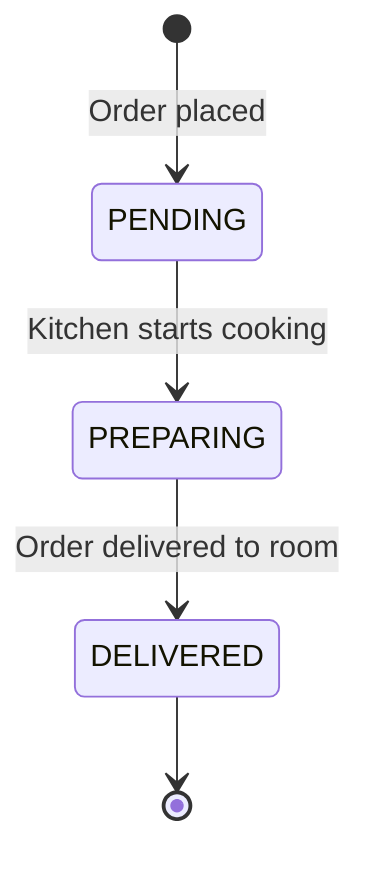

# Kitchen Orders

The Orders module handles food and beverage order placement for occupied rooms, tracks preparation status through the kitchen workflow, and automatically deducts ingredient stock.

---

## Order Lifecycle

| Status | Description |
|--------|------------|
| `PENDING` | Order received, waiting for kitchen |
| `PREPARING` | Kitchen is actively preparing the order |
| `DELIVERED` | Food has been delivered to the guest's room |

---

## Order Placement Flow

When an order is placed:

1. The system verifies the room is `OCCUPIED`
2. Each menu item is validated and priced
3. Ingredient stock is **atomically deducted** from the inventory
4. The order is saved with status `PENDING`
5. The total is calculated from `unitPrice × quantity` for each item

:::warning Stock Deductions
If matching inventory ingredients don't exist for a menu item, the system logs a warning but allows the order to proceed. This prevents kitchen operations from blocking on inventory data gaps.
:::

---

## Frontend UI

The Active Orders page provides:
- **Full order history table** with room numbers, itemized details, totals, timestamps, and status badges
- **Place Food Order modal** with occupied-room selector and interactive item basket
- **Status action buttons** — "Start Cook" (PENDING → PREPARING) and "Deliver" (PREPARING → DELIVERED)

The Dashboard also shows a **live pending orders section** for quick kitchen management.

---

## API Endpoints

See [API Reference → Orders](/docs/api-reference#orders) for complete endpoint details.
