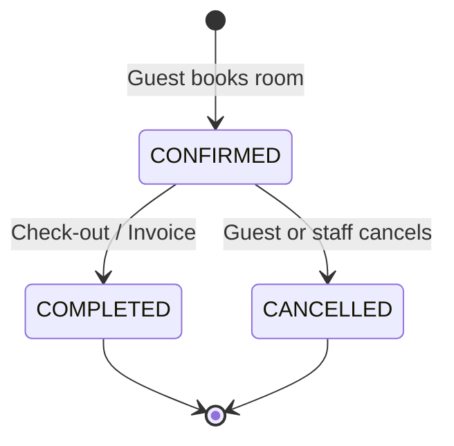

# Reservations

The Reservations module handles the full guest booking lifecycle from initial reservation through to checkout and invoice generation.

---

## Booking Lifecycle

### States

| Status | Description |
|--------|------------|
| `CONFIRMED` | Active booking — room is marked `OCCUPIED` |
| `COMPLETED` | Guest has checked out — invoice generated, room released to `AVAILABLE` |
| `CANCELLED` | Booking was cancelled — room released to `AVAILABLE` |

---

## Creating a Reservation

When a reservation is created:

1. The system verifies the room exists and is `AVAILABLE` for the requested dates
2. A `Customer` record is created or retrieved by email
3. The room status is set to `OCCUPIED`
4. The reservation is saved with status `CONFIRMED`
5. The `roomAvailability` cache is evicted for that room

---

## Check-Out Flow

Completing a reservation triggers:

1. Reservation status changes to `COMPLETED`
2. Room status returns to `AVAILABLE`
3. An **invoice** is automatically generated combining:
   - Room charges (nights × nightly rate)
   - All restaurant / room service orders billed to the room

---

## Frontend UI

The Reservations page in the dashboard provides:
- **Full booking table** with guest names, room numbers, dates, and status badges
- **New Booking modal** with room selector and date pickers
- **Check Out / Invoice** button that completes the reservation and shows the itemized invoice
- **Cancel** button for active bookings

---

## API Endpoints

See [API Reference → Reservations](/docs/api-reference#reservations) for complete endpoint details.
