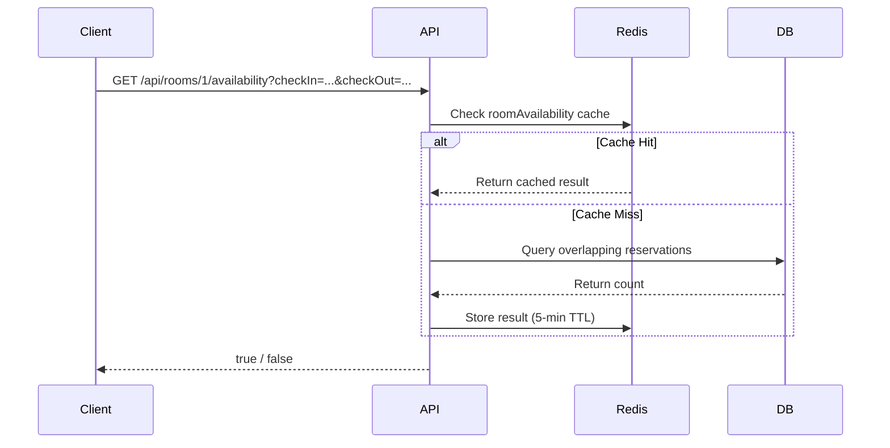

# Hotel Rooms

The Rooms module manages the hotel's physical room inventory — their types, pricing, amenities, and real-time availability status.

---

## Room Types

| Type | Description | Typical Price Range |
|------|------------|-------------------|
| `STANDARD` | Basic room with essential amenities | $80–$120/night |
| `DELUXE` | Enhanced room with premium furnishings | $120–$200/night |
| `SUITE` | Luxury suite with separate living area | $250–$500/night |

## Room Statuses

| Status | Meaning |
|--------|---------|
| `AVAILABLE` | Room is vacant and bookable |
| `OCCUPIED` | Guest is currently checked in |
| `MAINTENANCE` | Room is out of service for repairs/cleaning |

---

## Availability Checks

Room availability is determined by checking whether any **confirmed reservations** overlap with the requested date range. The result is cached in Redis with a **5-minute TTL** under the `roomAvailability` cache region.

---

## Frontend UI

The Rooms module in the frontend dashboard displays:
- **Card grid view** of all rooms with type, price, bed count, and amenities
- **Status filter tabs** — `ALL`, `AVAILABLE`, `OCCUPIED`, `MAINTENANCE`
- **Add Room modal** — create new rooms with all configuration fields

---

## API Endpoints

See the [API Reference → Room Management](/docs/api-reference#room-management) section for complete endpoint details.
